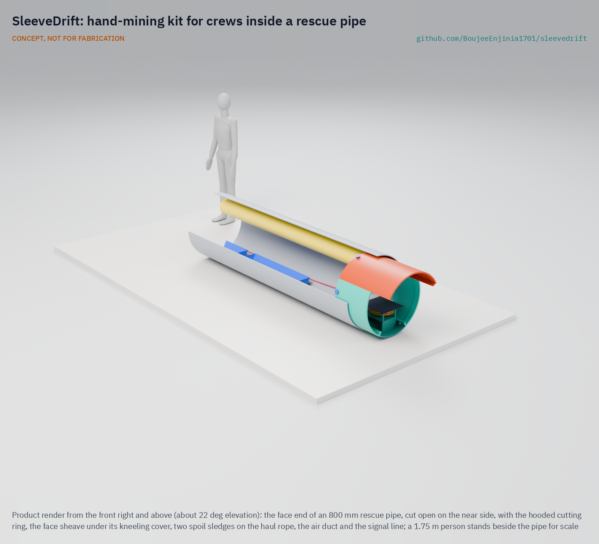
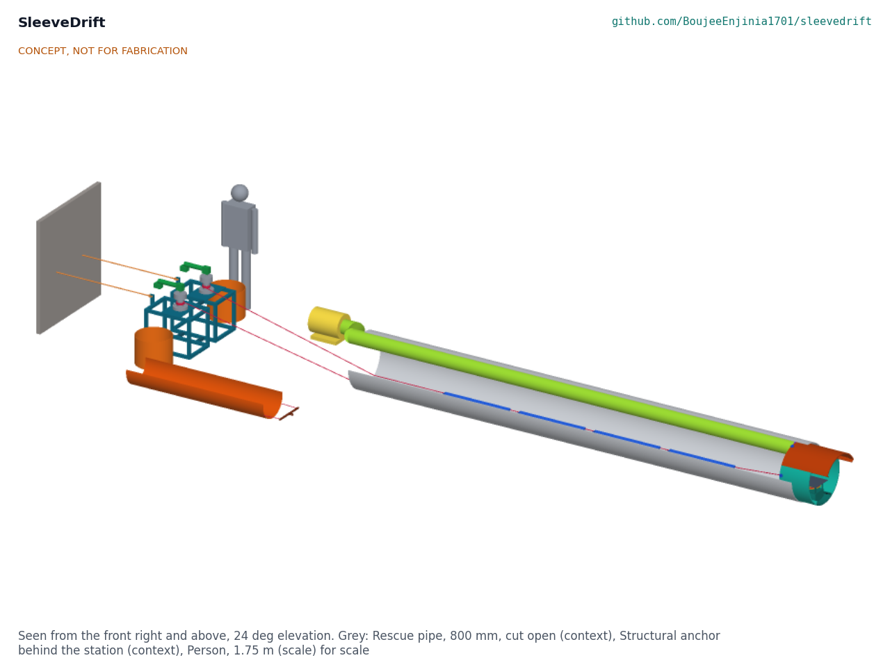
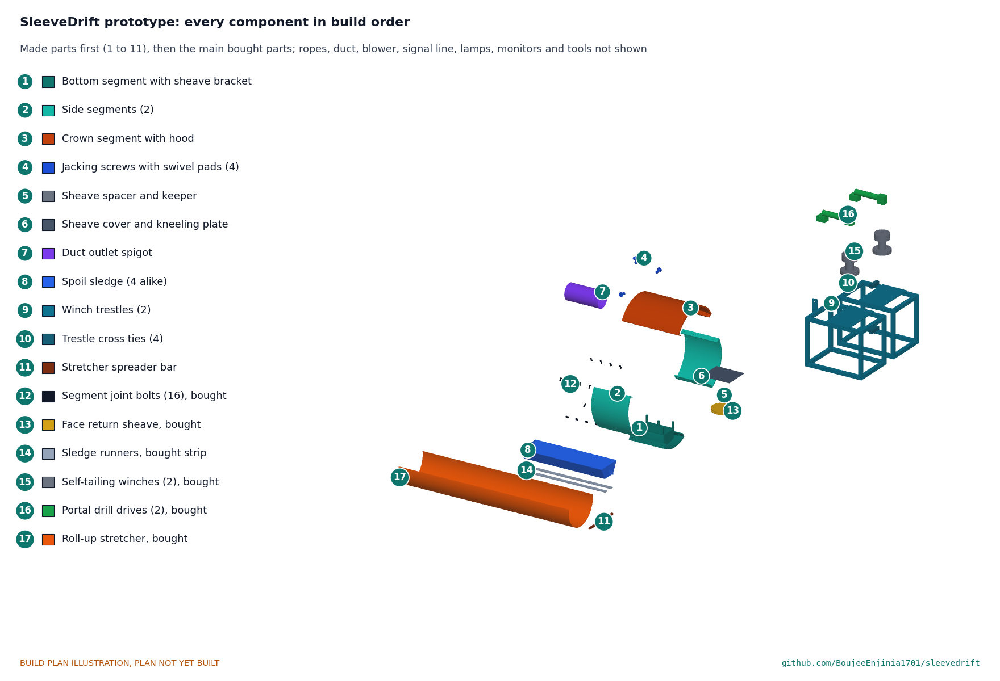

# SleeveDrift

   

**Area:** Situational field hardware · **TRL:** 3 of 9 (proof of concept on paper; constructable design) · **Value-engineering target:** USD 5,000; estimated parts cost USD 10,804 · **Difficulty:** 4 of 5

Equips hand-mining crews inside rescue pipes with a hooded ring, rope-loop sledges and air.

## Concept rationale

SleeveDrift is a set of equipment for hand-mining crews working inside an 800 mm rescue pipe. At the face, a hooded cutting ring sits in the pipe mouth: its edge helps the pipe cut into the debris and its hood shelters the digger's head and shoulders from falling material. Behind the digger, an endless rope loop runs the length of the pipe with small sledges clipped to it; the crew at the portal hauls the loop and the sledges carry spoil out and empty sledges back. An air line from a blower at the portal delivers fresh air to the face.

It formalises what worked at Silkyara: one person digs, a second collects the rubble and a third loads a trolley that is pulled out ([NewsBytes, 2023](https://www.newsbytesapp.com/news/india/uttarkashi-what-is-rat-hole-mining-used-in-collapsed-silkyara-tunnel/story)). Designing and testing that equipment in advance, openly, means the next crew does not have to improvise under pressure. It is published as an open engineering reference, not certified rescue or mining equipment.

## Burning platform

On 12 November 2023, part of the Silkyara tunnel in Uttarakhand collapsed and trapped 41 workers behind about 60 m of debris. Rescuers pushed an 800 mm escape pipe through the debris with an auger machine, which broke and jammed on 25 November after about 47 m ([Wikipedia](https://en.wikipedia.org/wiki/Uttarakhand_tunnel_rescue)). Crews then cleared the rest by hand, using hammers and chisels ([Wikipedia](https://en.wikipedia.org/wiki/Uttarakhand_tunnel_rescue)) and cutters to break stones and girders ([Global Kashmir, 2023](https://globalkashmir.net/manual-drilling-at-silkyara-tunnel-on-uttarakhand-cm-says-pipes-inserted-up-to-52-metres/)), and all 41 workers were brought out on 28 November ([Wikipedia](https://en.wikipedia.org/wiki/Uttarakhand_tunnel_rescue)).

The hand-mining team worked in four teams on eight-hour shifts, with three people inside the pipe at a time ([The News Minute, 2023](https://www.thenewsminute.com/news/explained-the-rat-hole-mining-technique-used-to-rescue-workers-in-uttarakhand-tunnel)), and advanced about 10 m in under 24 hours ([Scroll, 2023](https://scroll.in/latest/1059722/uttarakhand-tunnel-collapse-rat-hole-miners-begin-manual-drilling-to-reach-trapped-workers)). The skill came from rat-hole mining, a manual method from Meghalaya coal mines that India's National Green Tribunal banned in 2014 and that carries risks of asphyxiation ([The News Minute, 2023](https://www.thenewsminute.com/news/explained-the-rat-hole-mining-technique-used-to-rescue-workers-in-uttarakhand-tunnel)). The rescue worked, but it depended on finding the right people, and on improvised equipment, at the last moment.

## Where it could be used

### By industry

| Industry | Use |
| --- | --- |
| Tunnel construction (road, rail, hydropower) | Rescue equipment held at site for use if a collapse traps workers and machines fail |
| Disaster response and national rescue forces | A standard, documented kit and drill for pipe-based hand-mining rescue |
| Trenchless construction and pipe jacking | Face protection, spoil haulage and ventilation for hand excavation inside small jacked pipes |
| Mining | Escape and rescue drifts driven through collapsed ground |
| Military engineers and civil defence | Civilian rescue support where engineer units assist collapse rescues |

### By country or region

| Country or region | Why it matters there |
| --- | --- |
| India (Uttarakhand) | The 2023 Silkyara collapse trapped 41 workers for 16 days and was finished by hand mining after the auger failed ([Wikipedia](https://en.wikipedia.org/wiki/Uttarakhand_tunnel_rescue)). |
| India (Meghalaya) | Rat-hole mining, the source of the hand-mining skill, comes from Meghalaya coal mines and was banned in 2014 ([The News Minute, 2023](https://www.thenewsminute.com/news/explained-the-rat-hole-mining-technique-used-to-rescue-workers-in-uttarakhand-tunnel)), so the skill base may shrink. |
| India (Jhansi, Uttar Pradesh) | The Silkyara hand miners came from Jhansi and had worked in pipes as small as 600 mm ([Scroll, 2023](https://scroll.in/latest/1059722/uttarakhand-tunnel-collapse-rat-hole-miners-begin-manual-drilling-to-reach-trapped-workers)). |
| International rescue community | The Silkyara team contacted the team that freed the students from the 2018 Tham Luang cave in Thailand ([Wikipedia](https://en.wikipedia.org/wiki/Uttarakhand_tunnel_rescue)), showing how few groups hold this kind of confined-space rescue knowledge. |

## What sparked the idea

The spark was the last days of the Silkyara rescue in November 2023. After the auger machine broke with about 10 to 12 m of debris still to go ([Tribune, 2023](https://www.tribuneindia.com/news/india/silkyara-tunnel-collapse-parts-of-auger-machine-removed-from-rubble-566395)), a team of rat-hole miners crawled into the 800 mm pipe and dug by hand. As one of them described it, one man drills, another collects the rubble with his hands and the third puts it on a trolley to be pulled out ([Global Kashmir, 2023](https://globalkashmir.net/manual-drilling-at-silkyara-tunnel-on-uttarakhand-cm-says-pipes-inserted-up-to-52-metres/)). SleeveDrift starts from that description and asks what each of those three people should have had.

## Problem

When machines fail during a tunnel collapse rescue, crews may have to dig by hand inside a narrow rescue pipe. At Silkyara they did it with hand tools, a trolley and a blower; there is no open, tested kit for protecting the digger at the face, moving spoil out and keeping air in the pipe.

Full problem statement: [docs/01-problem.md](docs/01-problem.md)

## Concept

Equipment for hand-mining crews working inside an 800 mm rescue pipe during a tunnel collapse. A hooded cutting ring of four bolted steel segments sits in the pipe mouth, held by jacking screws, with its crown running on as a hood over the digger. A train of four low sledges shuttles spoil along the pipe floor between a pull rope and a tail rope that turns round a sheave on the ring; two self-tailing winches at the portal haul it, and breakaway swivels limit the rope to 2.5 kN. A blower at the portal sends about 15 m³/min of fresh air down a layflat duct to a spigot under the hood.

On paper every requirement is met except spoil haulage: with a cordless drill driving each winch at the portal the train moves about 0.42 m³ of spoil an hour (0.22 m³ by hand, the fallback) against a target of 1 m³, and rope wear over a 72-hour shift is at risk on paper, handled by inspecting the ropes every shift and carrying a spare set. Amish's decisions and the open questions are in [docs/06-design-decisions.md](docs/06-design-decisions.md).

Full design precis: [docs/02-concept.md](docs/02-concept.md) · Requirements: [docs/03-requirements.md](docs/03-requirements.md) · Calculations: [docs/04-calcs/01-sizing.md](docs/04-calcs/01-sizing.md) · Prototype build plan: [docs/05-build-plan.md](docs/05-build-plan.md) · Design decisions: [docs/06-design-decisions.md](docs/06-design-decisions.md) · [3D viewer](media/viewer.html)

## Key components

- Hooded cutting ring: crown segment with hood, two side segments, bottom segment, joint bolts
- Jacking screws with swivel pads
- Face return sheave with spacer, keeper and kneeling cover
- Spoil sledges (four) with runners, connecting links and breakaway swivels
- Pull rope and tail rope, 10 mm polyester
- Portal haul station: two self-tailing winches on welded trestles, rope bins, anchor slings
- Air line: blower, 200 mm layflat duct, magnet hangers, outlet spigot
- Lamps, sound-powered telephones and four-gas monitors
- Roll-up casualty stretcher with a towing spreader bar
- Face tool set

## Building the prototype

The [prototype build plan](docs/05-build-plan.md) (SVD-BLD-001) takes a capable fabricator through the eleven made parts and fourteen assembly steps, with a making sketch for every part, close-ups of eight joints and a picture for every step. The ring segments are rolled from 5 mm plate and bolted together in the pipe mouth; the sledges are folded sheet; the trestles are welded square tube. Everything else is bought. It is a plan, not a record of a build, and the first trials belong in a test pipe on open ground.

## Safety

> Rescue in a confined space under collapse debris: published as an open engineering reference, not certified rescue, mining or confined-space equipment. Not for fabrication as rescue equipment without testing.
>
> Work only under an incident commander, with a standby crew at the portal and a way to pull each person out.
>
> Air quality inside the pipe must be monitored continuously; the air line does not remove the need for gas and oxygen checks.
>
> The hood reduces, but does not remove, the risk from a face collapse. It has not been load tested.
>
> Moving ropes and the face sheave can trap hands and clothing: nobody on the rope lines or near the sheave while the train moves, and never bypass the breakaway swivels.
>
> Rotate crews to limit heat stress and fatigue.
>
> This design is published as an open engineering reference. It is not certified equipment.

## Repository layout

| Folder | Contents |
| --- | --- |
| `docs/` | Problem, concept, requirements, calculations and design decisions |
| `cad/src/` | build123d Python source, the source of truth for all geometry |
| `cad/step/`, `cad/stl/` | Exported models for FreeCAD, other CAD tools and printing |
| `cad/drawings/` | 2D sketches and dimensioned drawings |
| `bom/` | Bill of materials |
| `electronics/` | KiCad schematics and PCB layouts |
| `firmware/` | Microcontroller code |
| `media/` | Renders, perspectives and photos |
| `build-log/` | Dated prototyping notes |

## Documentation

Controlled documents follow the portfolio [documentation standard](.kit/STANDARDS.md). Each carries a document ID (SVD-PRC-001 for the precis), a version and a revision history. Branded PDFs are built with `python .kit/render.py` and attached to GitHub Releases when a document is tagged, for example `SVD-PRC-001/v1.0`.

## Credits

Designed by Amish Chadha at Design Molecule Labs. See [CONTRIBUTORS.md](CONTRIBUTORS.md) for roles. To cite this design, use [CITATION.cff](CITATION.cff) (GitHub shows it as "Cite this repository").

AI assistance (Claude) was used to accelerate prototype documentation and first-pass research. Design direction and all decisions are Amish Chadha's, recorded in this repository's decision records (`docs/decisions/`).

## Licenses

- **Hardware** (CAD, drawings, BOM, electronics): [CERN-OHL-S v2](LICENSE)
- **Software** (firmware, scripts, notebooks): [MIT](LICENSE-SOFTWARE)

A project of the [Design Molecule](https://designmolecule.com) lab.
