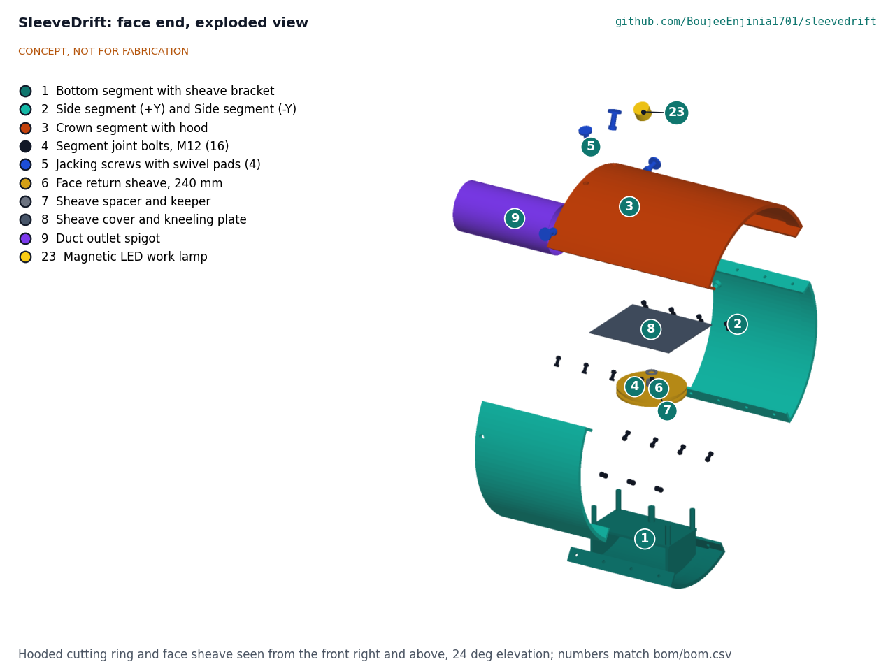
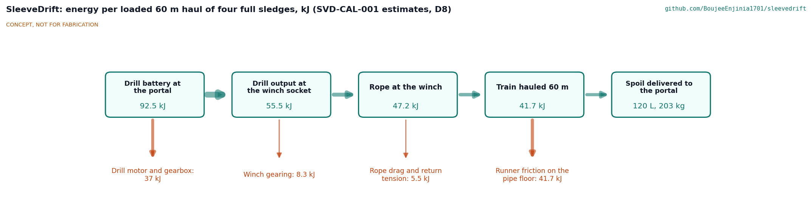

# SleeveDrift design precis

Equips hand-mining crews inside rescue pipes with a hooded ring, rope-loop sledges and air.

*Figure 1. Concept render in the shortened picture layout (6.8 m of pipe instead of 60 m; the station 2.4 m behind the mouth instead of 5.5 m). The pipe is cut open on the near side. CONCEPT, NOT FOR FABRICATION.*

SleeveDrift gives the three people at the face of a hand-dug rescue drift what they had to improvise at Silkyara: a steel hood over the digger, a rope haul that carries spoil 60 m back to the portal without anyone dragging it, and fresh air delivered behind the hood. On paper every piece passes along an 800 mm pipe and weighs under 35 kg, the hood carries 5 kN with almost no deflection, the portal crew turns the winch with under 100 N, and a casualty can be pulled out in about 3.5 minutes. The miss is output: by hand the haul moves about 0.22 m³ of spoil an hour against a target of 1 m³ (SVD-CAL-001). This is an open engineering reference, not certified rescue, mining or confined-space equipment.

## How it works

The **hooded cutting ring** is a short steel sleeve, 760 mm outside diameter, made of four rolled segments bolted together through flanges on the inside. It sits in the mouth of the lead pipe with 200 mm inside the pipe and 250 mm beyond it; the crown segment runs on another 250 mm as a hood over the digger's head and shoulders. The ring rests on the pipe invert, and four jacking screws in its upper half press swivel pads against the pipe wall to hold it. Nothing is drilled or welded to the pipe. The front edges are bevelled so the ring helps the pipe cut into the loosened debris as it is pushed.

A **return sheave** lies flat on a bracket welded to the bottom segment, under a chequer-plate cover that doubles as a kneeling plate. The **haul** is a shuttle: a train of four low sledges runs along the pipe floor between a pull rope and a tail rope. The pull rope runs back to winch A at the portal; the tail rope runs forward from the train, round the face sheave and back along the floor beside the train to winch B. Winding winch A brings the loaded train out while winch B eases; winding winch B sends the empty train back in. A breakaway swivel at each end of the train parts at 2.5 kN, so a jam cannot overload the rope, the sheave or the ring.

The **air line** is a 200 mm blower at the portal feeding layflat duct hung on magnet hangers along the upper wall of the pipe, ending on a steel spigot held in two saddles inside the crown, just behind the hood. A **signal line** of sound-powered telephones (no batteries) runs on the same hangers, with a pull-cord bell as backup; battery lamps light the face. A **roll-up casualty stretcher** with a towing spreader bar clips into the same ropes in place of the train.

The digger breaks the face with short hand tools under the hood; the second crew member loads the spoil into the sledges; the portal crew of two hauls and empties the train. A third person at the portal is the standby.

*Figure 2. Face end, exploded: crown segment with hood, two side segments, bottom segment with the sheave bracket, jacking screws, sheave, cover and duct spigot. Numbers match `bom/bom.csv`.*

*Figure 3. Face end cut through the pipe axis: the hood, a crown jacking screw, the sheave under its cover and the duct spigot.*

## Components

*Table 1. Components, with their BOM lines.*

| # | Component | Role | BOM |
| --- | --- | --- | --- |
| 1 | Hooded cutting ring | Four bolted 5 mm segments (crown with hood, two sides, bottom); protects the digger and helps the pipe cut | 1 to 4 |
| 2 | Jacking screws with swivel pads | Hold the ring in the pipe mouth without drilling or welding | 5 |
| 3 | Return sheave, spacer, keeper and cover | Turns the tail rope at the face; the cover is a kneeling plate and a guard | 6 to 8 |
| 4 | Duct outlet spigot | Holds the end of the air duct inside the crown, behind the hood | 9 |
| 5 | Spoil sledges with runners and links | Train of four 30 L folded trays on UHMW-PE runners | 10 to 12 |
| 6 | Breakaway swivels | Release at 2.5 kN at each end of the train (R11) | 13 |
| 7 | Pull rope and tail rope | 10 mm polyester double braid, 18 kN | 14 |
| 8 | Portal haul station | Two welded trestles with cross ties, two two-speed self-tailing winches, rope bins, anchor slings | 15 to 19 |
| 9 | Air line | Blower, 65 m of 200 mm layflat duct, magnet hangers | 20 to 22 |
| 10 | Light, signal and gas | Battery lamps, sound-powered telephones and cable, two four-gas monitors (R12) | 23 to 25 |
| 11 | Casualty stretcher | Roll-up stretcher with a towing spreader bar and bridle | 26, 27 |
| 12 | Face tool set | Short-handled spade and pick, hammer, chisels, bolt cutter, hacksaw, scoop pans | 28 |

## Key design choices

All were decided by Amish under his pre-approvals of 2026-10-03 (SVD-DDR-001 and SVD-DDR-002).

- **Segmented ring, no fixing to the pipe.** A one-piece ring weighs about 85 kg and cannot be handled in the pipe. Four segments of 17 to 31 kg ride in on a sledge, and jacking screws avoid drilling, welding or power at the face.
- **Ring resting on the invert.** The crown screws press it down onto the pipe floor, so the hood load goes into the pipe through contact, with no free play.
- **Shuttle, not a circulating loop.** Two lanes of sledges (out and back) do not fit beside each other with a crew in a 780 mm bore. One train shuttles; the return leg of the rope lies on the floor beside it.
- **Two self-tailing winches.** A single winding drum for 60 m of travel would be 1.4 m long and need about 13 m of lead to keep the rope's fleet angle small. Bought two-speed self-tailing winches hold the load on their own pawls, take any length of rope, and let the crew hand-haul through the drum for a casualty.
- **Overload limit by breakaway swivels.** A person heaving on a winch handle in low gear can put over 13 kN on the rope. Cable-pulling breakaway swivels set at 2.5 kN bound every force in the system.
- **Sound-powered telephones.** They need no batteries and keep R8 simple; the pull-cord bell is the backup.

## First-order numbers

*Table 2. First-order numbers (SVD-CAL-001; estimates on paper).*

| Quantity | Value | Assumption |
| --- | --- | --- |
| Pipe bore and ring | 780 mm bore; ring 760 mm OD, 450 mm long plus 250 mm hood | 800 x 10 mm pipe as at Silkyara |
| Clear crawl circle beside the duct | 554 mm | Duct on the upper +Y wall |
| Heaviest piece in the pipe | Crown segment, 31.0 kg | 5 mm S355 plate |
| Hood at 5 kN | 5.5 MPa, under 0.1 mm deflection | Crown alone as a 500 mm cantilever |
| Train | 4 x 29.9 L = 120 L, 203 kg of spoil | Loose spoil 1.7 kg/L |
| Pull, loaded and starting | 786 N and 1,018 N | Runners on gritty steel, friction 0.30 and 0.40 |
| Handle force, high gear | 71 N loaded, 92 N starting | Power ratio 13, efficiency 0.85 |
| Output by hand | 0.22 m³/h | One person cranking at 60 W, 32.7 min cycle |
| Casualty, 60 m | 3.5 min | Three people hauling hand over hand at 0.4 m/s |
| Air at the face | 15.1 m³/min | 0.27 m³/s at the blower, 525 Pa, 6.5 % leakage |
| Set-up | 1.6 h | Sequence in SVD-CAL-001, section G |
| Kit mass | 304 kg in 12 packages, heaviest 34.8 kg | |

Value-engineering target: USD 5,000. Estimated cost of the constructable design: USD 9,867.50 (USD 4,867.50 over the target). The two winches, the gas monitors, the telephones and the air line are most of it.

*Figure 4. Energy per loaded 60 m haul (estimates): almost all of the work at the handle goes into dragging the sledges along the pipe floor.*

## Patent design-arounds

From the preliminary patent, trademark and prior-art screen (not legal advice):

- Avoid proprietary steering joints and articulated shield geometry used in commercial hand-mining systems; the ring is a fixed, non-steering sleeve bolted rigid, with no articulation between segments.
- Cite the Silkyara record as the public source of the three-person method.

## Shared blocks

- The SiltHaul hand capstan was considered for the portal station and not used: its single-layer drum holds about 12 m of rope, and a 60 m version would be 1.4 m long. SleeveDrift uses bought self-tailing winches instead (SVD-DDR-002). SaltDrag and SiltHaul are not edited here.
- CalRig is the first candidate rig for the hood load test (R2) and the proof loads of the sheave bracket and anchor slings.
- HatchSide's confined-space air practice is the first reference for the air line and gas monitoring rules.

## Safety

> **Safety:** Rescue in a confined space under collapse debris. SleeveDrift is published as an open engineering reference, not certified rescue, mining or confined-space equipment.
>
> - Work only under an incident commander, with a standby crew at the portal and a way to pull each person out.
> - Air quality inside the pipe must be monitored continuously at the face and at the portal (R12); the air line does not remove the need for gas and oxygen checks. Keep the blower intake in clean air, away from engine exhausts.
> - The hood reduces, but does not remove, the risk from a face collapse; it has not been load tested.
> - Moving ropes and the face sheave can trap hands, feet and clothing. Nobody is on the rope lines or near the sheave while the train moves; hauling starts only on a clear signal from the face, and the cover stays on the sheave.
> - The breakaway swivels set the overload limit. Never replace a shear pin with a bolt or a stronger pin.
> - Winch handles are removed when not in use; the easing winch is tended at all times.
> - Rotate crews to limit heat stress and fatigue.

## Questions for the first trials

- How fast does a trained crew load and empty the sledges, and how fast does the face produce spoil?
- How quickly does the rope wear on a gritty pipe floor over a 72-hour shift?
- Do the jacking screw pads hold on a painted or rusty pipe at the friction assumed (0.20)?
- What does the co-design partner want for a 600 mm pipe?
